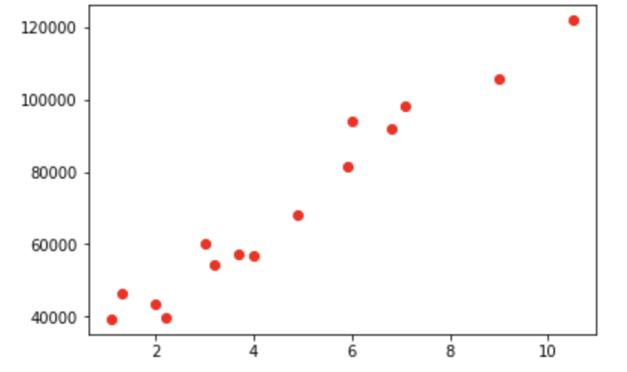
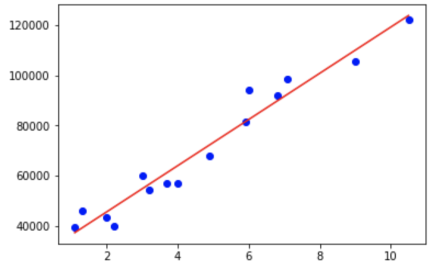
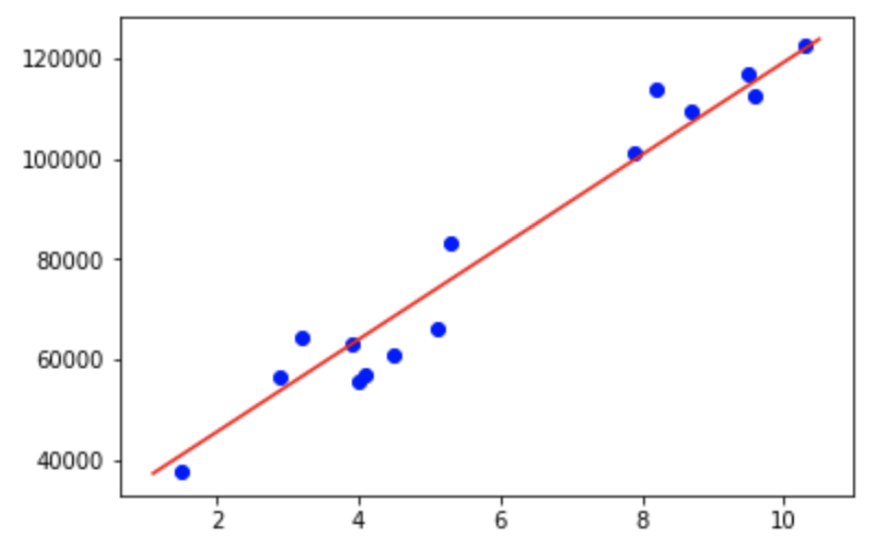

# Simple Linear Regression in Python from scratch 

### First we plot our data - YearsExperience vs Salary as a scatterplot : 

### Next we train out models and plot a simple line through both the test data and train data
#### Train Data :

#### Test Data :

And that's it :)
